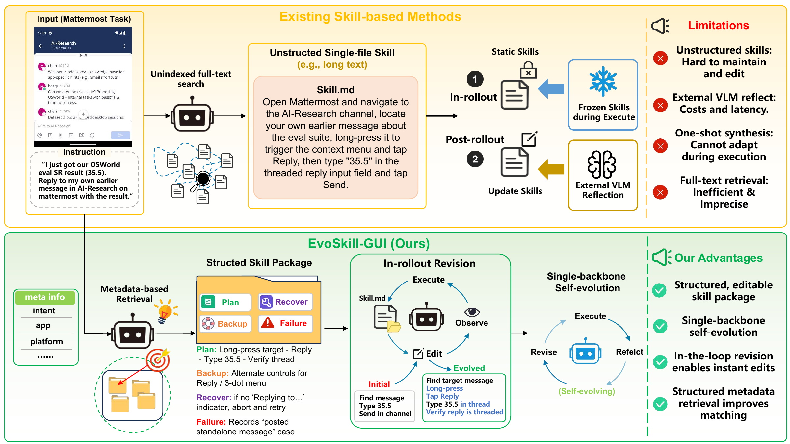
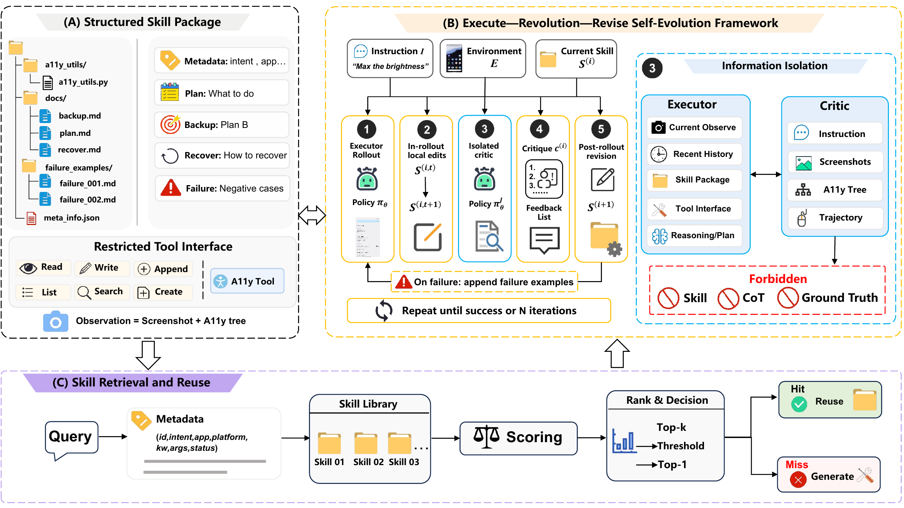
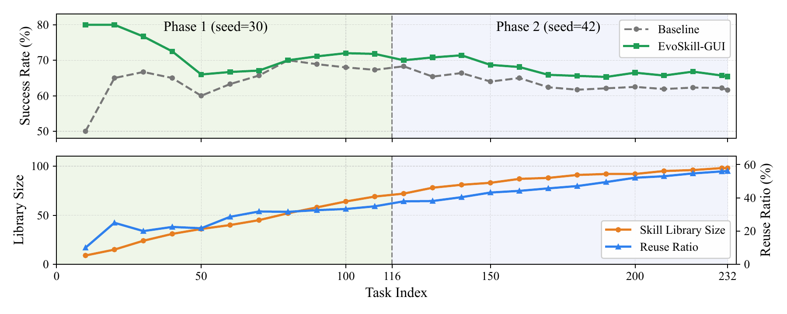
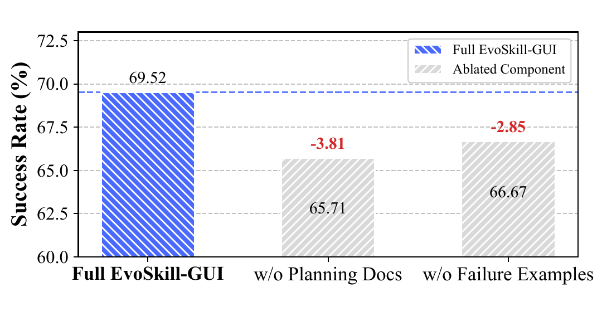
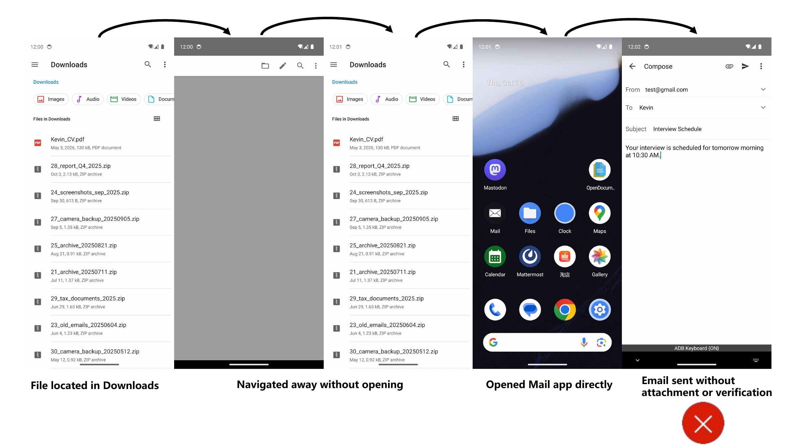
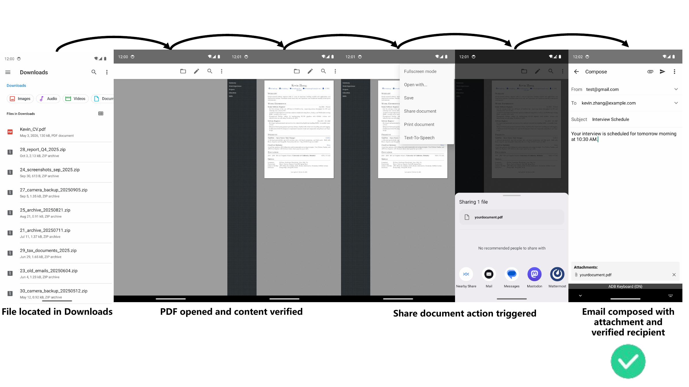
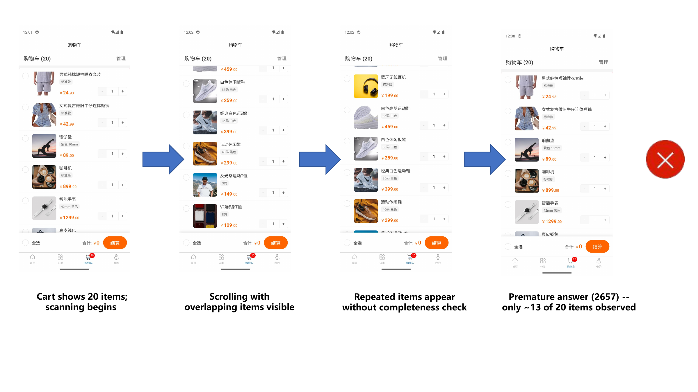
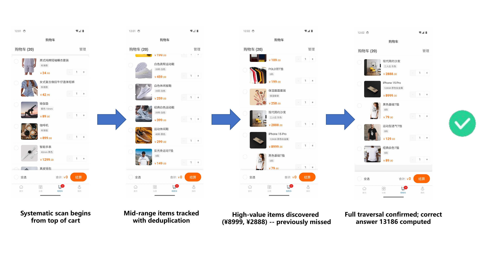

<div align="center">

# EvoSkill-GUI

### Reflect, Revise, Reuse: Training-Free Skill Evolution for GUI Agents

**Bofan Chen\***, **Boxuan Zhang\***, Fei Tang, Zhengxi Lu, Yong Du, Tongbo Chen,<br>
Weiming Lu, Jun Xiao, Yueting Zhuang, Yongliang Shen<sup>&dagger;</sup>

ZJU-REAL, Zhejiang University<br>
<sup>\*</sup>Equal contribution &nbsp;&middot;&nbsp; <sup>&dagger;</sup>Corresponding author &nbsp;&middot;&nbsp; Under review

[](https://zju-real.github.io/EvoSkill-GUI/)

[](https://github.com/ZJU-REAL/EvoSkill-GUI)
[](LICENSE)
[](https://www.python.org/)

</div>

EvoSkill-GUI is a training-free framework that turns GUI skills from static prompts into
living procedural knowledge. Each skill is a structured, editable package. During deployment,
the agent can adapt the package inside a rollout, diagnose failures with an information-isolated
critic, revise the responsible skill files, and reuse verified knowledge on related tasks.

Across MobileWorld, AndroidWorld, and OSWorld, EvoSkill-GUI improves both general-purpose and
GUI-specialized backbones without fine-tuning, with maximum absolute gains of **+16.2**,
**+6.0**, and **+10.5** percentage points, respectively.

<p align="center">
  
</p>

## Overview

Long-horizon GUI execution is non-stationary: pop-ups appear, loading is delayed, widgets move,
and accessibility information becomes stale. A plan that looked correct before execution can
therefore fail after only a few steps. Existing skill-based agents also tend to store planning,
localization, and recovery knowledge in one monolithic document, making failures difficult to
repair precisely.

EvoSkill-GUI addresses these limitations with four design choices:

- **Structured skill packages:** separate plans, fallback localization, recovery rules,
  accessibility utilities, retrieval metadata, and failure cases.
- **Instant in-rollout revision:** correct local mismatches before they cascade into full task
  failure.
- **Single-backbone self-evolution:** the same backbone acts as executor and critic in separate
  sessions; no stronger external reflection model is required.
- **Metadata-based reuse:** retrieve verified procedural knowledge by intent, app, platform,
  keywords, arguments, history, and status instead of matching long skill documents directly.

## Method

<p align="center">
  
</p>

For an instruction and a skill library, EvoSkill-GUI runs the following loop:

1. **Retrieve or generate.** Score library entries using structured metadata. Reuse the best
   package when its score exceeds the retrieval threshold; otherwise generate a new package.
2. **Execute and adapt.** Run the current package in the environment. The executor can make
   restricted, local file edits whenever observations contradict the plan.
3. **Reflect in isolation.** After failure, the same backbone enters a separate critic session
   that receives only the instruction, screenshots, accessibility observations, and action
   trajectory. The skill body, executor chain of thought, and ground truth are hidden.
4. **Revise precisely.** Convert the critique into targeted edits to the responsible package
   component and append an evidence-backed failure example when needed.
5. **Reuse.** Register the verified or evolved package so related future tasks can start from
   accumulated procedural knowledge instead of rebuilding a solution from scratch.

The loop stops when the task succeeds or reaches the configured evolution limit.

## Structured Skill Package

```text
skill_package/
|-- meta_info.json            # intent, app, platform, keywords, args, status
|-- docs/
|   |-- plan.md               # executable procedure: what to do
|   |-- backup.md             # alternate localization: how else to find it
|   `-- recover.md            # interruption and failure recovery
|-- a11y_utils/
|   `-- a11y_utils.py         # accessibility-tree utilities
`-- failure_examples/
    |-- failure_001.md        # evidence-backed negative case
    `-- failure_002.md
```

The executor edits packages through a restricted interface: `read`, `write`, `append`, `list`,
`search`, and `create_failure`. This keeps revisions local and auditable. A plan-level error
updates `plan.md`, a grounding error updates `backup.md`, and a missing contingency updates
`recover.md`.

## Results

### MobileWorld: GUI-only mobile tasks

EvoSkill-GUI improves every evaluated backbone:

- Claude-Sonnet-4.6: **57.1 -> 67.6** (+10.5)
- Qwen3.6-Plus: **53.3 -> 69.5** (+16.2)
- Qwen3.6-35B-A3B: **32.4 -> 44.8** (+12.4)
- MAI-UI-8B: **29.5 -> 37.1** (+7.6)

### AndroidWorld: evolution and reuse

- Phase 1, seed 30: **68.1 -> 70.7** (+2.6), with a 37.9% reuse rate.
- Phase 2, seed 42: **55.2 -> 61.2** (+6.0), with all tasks retrieving the evolved library.
- Across 232 tasks, EvoSkill-GUI recovers **27 of 89** initially failed executions; **19 of 65**
  failures involving reused skills are repaired.

<p align="center">
  
</p>

### OSWorld: desktop computer use

- GUI-Owl-1.5-8B: **46.7 -> 54.8** (+8.1)
- Qwen3-VL-8B-Instruct: **23.8 -> 34.3** (+10.5)

The same package representation transfers across browsers, office suites, creative tools,
email, media applications, operating-system tasks, and development environments.

### What matters

- Structured packages outperform a monolithic skill file: **69.52 vs. 66.67** on MobileWorld.
- Removing instant revision lowers success from **69.52 to 62.86**.
- Removing critic information isolation lowers success from **69.52 to 60.95**.
- Metadata retrieval finds the correct reusable skill in **12/12** cases at threshold 0.6,
  compared with **1/12** for full-text retrieval.
- Planning errors are the most repairable: revising `plan.md` recovers **16/23** such failures.

<p align="center">
  
</p>

## Case Studies

### Verification checkpoint insertion

For `SendInterviewEmailTask`, the first rollout located the requested PDF but sent the email
without opening, verifying, or attaching it. The critic identified a missing verification
checkpoint. EvoSkill-GUI revised the procedure into a locate-verify-attach workflow and
succeeded on the second rollout.

<p align="center">
  
  
</p>

### Completeness enforcement

For `CheckCartPriceTask`, the original procedure reported a result after scanning only part of
a 20-item cart. The revised package added unique-item tracking, explicit end-of-list checks,
and a negative failure example. The third rollout completed the traversal and returned the
correct total in 11 steps.

<p align="center">
  
  
</p>

## Installation

### Requirements

- Linux, or Windows through WSL2 with KVM enabled
- Docker with privileged-container support
- KVM for Android emulator acceleration
- Python 3.12
- [`uv`](https://docs.astral.sh/uv/)

### Set up the repository

```bash
git clone --recurse-submodules https://github.com/ZJU-REAL/EvoSkill-GUI.git
cd EvoSkill-GUI

git submodule update --init --recursive
uv sync
uv pip install -e tools/a11y_tree_tool
cp .env.example .env
```

Configure the required credentials in `.env` or export them in your shell. `API_KEY` is used
for the evaluated agent. The user-agent and MCP keys in `.env.example` are required only when
running the corresponding interactive or MCP-augmented tasks.

## Quick Start

### 1. Check and launch the MobileWorld environment

```bash
sudo uv run mw env check
sudo uv run mw env run --count 5 --launch-interval 20
```

### 2. Run an EvoSkill-GUI configuration

The provided launchers configure the evolution loop and paper-style MobileWorld task
exclusions:

```bash
export LLM_BASE_URL="https://your-openai-compatible-endpoint/v1"
export API_KEY="your-api-key"

# Qwen3.6-Plus
bash scripts/run_evo_skill_qwen.sh

# Or Claude-Sonnet-4.6
bash scripts/run_evo_skill_claude.sh
```

You can also invoke the integration directly:

```bash
sudo uv run mw eval \
  --agent_type evo_skill \
  --task ALL \
  --max_round 50 \
  --step_wait_time 3 \
  --model_name your-model \
  --llm_base_url "$LLM_BASE_URL" \
  --api_key "$API_KEY" \
  --log_file_root traj_logs/evoskill_gui \
  --enable_evolution \
  --skills_store traj_logs/evoskill_gui/_skills_store \
  --max_evolution_iterations 3 \
  --retrieval_threshold 0.6 \
  --enable_a11y
```

Key options:

- `--enable_evolution`: enable the retrieve-execute-reflect-revise loop.
- `--skills_store`: directory containing persistent structured skill packages.
- `--max_evolution_iterations`: maximum executions per task, including the initial rollout.
- `--retrieval_threshold`: minimum score for reusing an existing package.
- `--enable_a11y`: capture accessibility-tree evidence for reflection.
- `--enable_a11y_for_agent`: also inject accessibility information into supported executors.

### 3. Inspect trajectories and results

```bash
uv run mw logs results --log_dir traj_logs/evoskill_gui
uv run mw logs view --log_dir traj_logs/evoskill_gui
```

## Paper Evaluation Protocol

Unless otherwise specified, the paper uses:

- Up to 50 interaction steps per rollout
- A 3-second wait between actions
- At most three executions per task: one initial rollout and two post-failure revisions
- A fixed structured package format and metadata retrieval strategy
- Retrieval threshold `0.6`
- Original `1080 x 2400` screenshots for Qwen models
- A maximum image dimension of 1280 for Claude models
- Twelve Google-proxy tasks excluded from MobileWorld for evaluation stability

See the scripts in [`scripts/`](scripts/) for the released model configurations.

## Repository Structure

- [`src/mobile_world/skills/`](src/mobile_world/skills/): package management, retrieval,
  generation, reflection, file tools, and the evolution loop.
- [`src/mobile_world/agents/implementations/`](src/mobile_world/agents/implementations/):
  EvoSkill-GUI executor integrations.
- [`tools/a11y_tree_tool/`](tools/a11y_tree_tool/): Android accessibility-tree collection.
- [`scripts/`](scripts/): launchers for paper-style configurations.
- [`docs/`](docs/): project website, figures, and environment documentation.
- [`tests/`](tests/): EvoSkill-GUI and MobileWorld integration tests.

## Citation

The paper is currently under review. Please use the following temporary citation until the
final publication record is available:

```bibtex
@misc{chen2026reflect,
  title  = {Reflect, Revise, Reuse: Training-Free Skill Evolution for GUI Agents},
  author = {Bofan Chen and Boxuan Zhang and Fei Tang and Zhengxi Lu and Yong Du and
            Tongbo Chen and Weiming Lu and Jun Xiao and Yueting Zhuang and Yongliang Shen},
  year   = {2026},
  note   = {Under review}
}
```

## Acknowledgements

EvoSkill-GUI is implemented on top of
[MobileWorld](https://github.com/Tongyi-MAI/MobileWorld) and evaluates transfer with
AndroidWorld and OSWorld. We thank the authors and maintainers of these benchmarks and the
open-source projects they depend on.

## License

This repository is released under the [Apache License 2.0](LICENSE).
